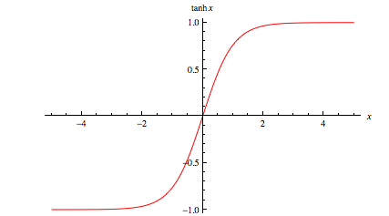

### More on Neural Nets

We can use a logistic node in Enterprise Miner to do our variable selection for the neural net.

Because the functions are not linear, we won't have perfect colinearity, though we can have colinearity problems

### Likelihood function
- What value of p will maximize the function f(p)=p^x(1-p)^x
- You are fixing the data itself, but looking for the parameters which maximize the likelihood

Challenges with neural nets: 
- How many latent functions are there?
- Interpretation of the model.  Like ARIMA, "neither method constructs a model to be explicitly interpreted."

### What is a Neural Network?
Neural networks are a wide class of flexible non-linear regression and discriminant models, data 
reduction models and non-linear dynamic systems. 

Hyperbolic tangent function squashes the outliers

### Enerprise Miner
