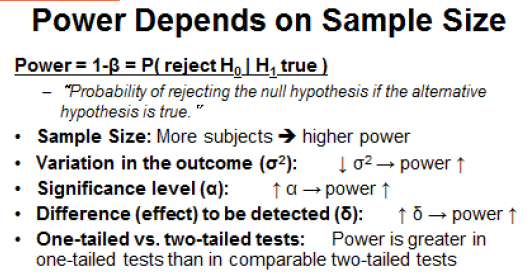
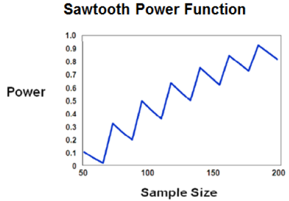

#Design of Experiments

## Lecture 1 - Introduction
### Background
- Definition: Nuisance variables - variables which you are not interested in for the experiment, but which influence the dependent variable
 - known nuisance variables cause systematic bias
 - unknown nuisance variables are called inherent variability or noise
- Definition: Design of Experiments - "experimental design is the design of any information-gathering exercises where variation is present, whether under the full control of the experimenter or not. However, in statistics, these terms are usually used for controlled experiments." (wikipedia)
 - originated in agriculture by Ronald A. Fischer
- Definition: Efficiency - Information gained / cost
 - information gained - in terms of factors tested and in terms of margin of error
 - cost - finanical cost, sample size

### Key Terms
- Response - dependent variable
- Factor - independent variable
- Factor Level - values of factor chosen for experiment
- Effect - difference in response values for different levels of a factor
- Treatment - a combination of all factors, each at one level
- Experimental Unit - smallest unit to which a treatement can be applied
- *Power* - Probability you will detect an effect if one exists. In other words, Probabiltiy that the null hypothesis is rejected, given that the null hypothesis is false
 - effected by alpha, sample size, effect size, distribution
- Replication - more that one experimental unit gets the same treatment
- *Balance* - equal counts in each treatment
- *Orthogonality* -

### Power
- DEFINITION: Probabiltiy that the null hypothesis is rejected, given that the null hypothesis is false
 - replication will decrease variance and increase power
 - an experiment is powerful if it has a high probability of rejecting the null hypothesis (when the null if false)

|    |      Decision - H0    |  Decision - Ha |
|----------|:-------------:|------:|
| **Truth - H0** |  Pr(correct negative) = 1-alpha | Pr(false positive) = Pr(Type 1 error) =  alpha |
| **Truth - Ha** |    Pr(false negative) = Pr(Type II error) = beta|   Pr(correct positive) = Power = 1-beta  |

- Choosing an alpha determines the probability of a type 1 error. For example, a 5% alpha will mean that 1/20 comparisons that are deemed significant will be due to sampling variation.
- Control of Type II errors is *more complex.*
 - for a two-sample t-test, the power depends on
   - sample size: higher sample size => higher power
   - ratio of group samples sizes: maximum power when sample sizes for the two groups are equal. however, if you have an imbalance you should not eliminate observations in order to gain balance - this would reduce the power.
  - alpha - the higher the alpha, the higher the power.  very small alphas will have smaller powers.
  - mean difference or effect size - the larger the estimated difference, the larger the power
  - standard deviation or variability - the smaller the variability, the larger the power.

### Estimating Parameters for power size calculation
- use subject matter experts or historical data

### Observed Power
- assuming that the observed effects and variability are equal to the true parameters, the probability of rejecting the null hypothesis is computed
- advocates of observed power argue that there is evidence for the null hypothesis being true if the statistical significance was not achieved despite the computed power being high at the observed effect size

## Lecture 2 - Power and Sample Size

### Power and Sample Size
- Power: 1-Beta. The chance that one detects a difference from the null hypothesis, if a difference as extreme as the alternative exists
- Power usually set to 80% or more, but you have to think about the consequences of a Type II error.
- For the same effect size, the higher the power the higher the sample size required
- Smaller alpha => lower power
- smaller standard deviation => higher power

### Prospetive vs. Retrospective Power Analysis
 - Prospective is *good*, while retrospective is *bad*

- Power for binomial distribution (for example, response to credit card offer)
 - distribution is not continuous, so PROC POWER always give an alpha that is below your specified alpha

### Sawtooth Power Function
- Normally, the larger the sample, the greater the power
- However, with discrete data you cannot acheive the exact alpha desired, so a smaller than desired alpha is chosen. Since power is a function of alpha, this results in a decrease in power.

## Lecture 3 - Power and Sample Size

### Test of Two Independent Proportions
- Pearson chi-squared (SAS default)
- Likelihood ratio test
- Fisher's exact test: use for cases with small expected cell frequencies (less than 5)
Effect sizes represented as
- proportion difference
- odds ratio
- relative risk
Sample Size Allocation
- common sample size per group (balanced design)
- sample size allocation weights for two groups
 - as you depart from a balanced design, the required sample size necessary to acheive a given power will increase.
- two group sample size

## Lecture 4 - Multiple Factor Analysis

### Two Two-Level Factors
- Example: Introductory CC rate high (2.99%) or low (0%) AND goto rate is high (7.99%) or low (4.99%)
- Unsophisticated experiments use OFAT - one factor at a time. no interactions
- factorial experience - include interactions, but require larger samples
- balanced sample sizes are more efficient, so use when possible
- Definition: Orthogonal Design - factors are uncorrelated with each other. you can estimate effects independent with each other and independent of the interactions
- If the values hypothesized to not include an interaction

### Efficiency
- amount of information / cost of experiment
- efficience designs must be *orthogonal* and *balanced*

### Steps in Design of Experiments
- Select experimental design
- Do power analysis based on design

## Lecture 5 - Blocking
- 

## Lecture 6 - Fractional Factorial Experiments
## Lecture 7 - Optimal Designs
