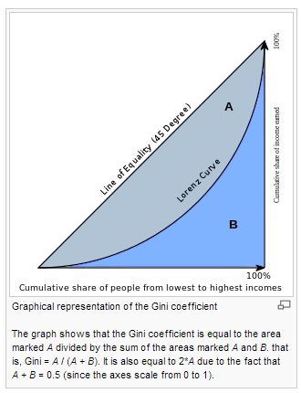

Toolkit
- Data Manipulation Tools for modifying CSVs: PERL, regular expressions.  Cool book - Data Munging in PERL
- Interactive Analysis start with Excel.  If data is too big, sample.
- You need a general purpose programming tool to complement R.  
- Free viz tool - ggobi
- Version Control tool

Decision Tree
- 1st part of algorithm is split-search
 - Cateogrical Splitting
  - When splitting is done with the chi-squared criteria, split to maximize the log worth (- log chi-squared p-value)
   - criteria is usually somewhat more complicated - for example, you cannot have fewer than a specified number of observations in a branch
   - bonferroni correction used to adjust p-values since many statistical tests are being done in parallel
   - in addition, each level of the tree depends on the p-values of prior splits.  There is an additional depth adjustment to the p-values. 
  - algorithm tries putting missing values on both left and right side of split
  - Gini and entropy reduction don't have p-value associated, so they tend to grow large trees
  - Gini
   - commonly used as measure of inequality of income
   - defined as ratio of the areas on the Lorenz curve diagram
   - 
 - Continous variables 
  - Split by variance and ProbF logworth
- 2nd Part: Pruning
 - Remove a specified number of branches from the tree.  Various combinations will produce different subtrees.  
 - Assess each with validation data and choose the best performing simplest model.
 - statistic used to assess tree will depend on whether you want a ranking, decision, or estimate.
  - Decision
   - can be evaluated by accuracy / misclassification rate
  - ranking
   - evaluated by concordance
  - estimate
   - evaluated by squared error
  - The pruning stage is different depending on whether we want ranking, decision, or estimate.  This doesn't make a difference on the first stage.

Neural Nets
- Flexiblity comes with risk of overfitting & lack of variable selection method
- optimization algorithm called "stopped training" reduces changes of overfitting
- neural net is a regression on a set of derived inputs, called hidden units
- hidden units include a link function / activation function, typically the hyperbolic tangent function
- model can be considered in "layer": input layer, hidden layer, output layer
- the hyperbolic tangent function smushes down outliers

Models can be used for Decisions, Rankings, or Estimates.

### Techniques to Know:
Rule induction
- combination of decision trees & neural nets
- useful for rare events
- decision tree is used to filter out "easy to classify" cases, then neural network examines remaining.
Memory Based Reasoning (MBR) / k-nearest neighbor
- "an object is classified by a majority vote of its neighbors, with the object being assigned to the class most common amongst its k nearest neighbors"
Dmine Regression
- all continous variables are binned
- binned and individual continous variables are used in input selection
LARS - Least Angle Regression
- explanations of this don't make all that much sense to me... need to look for clearer explanation
Partial Least Squares Regression
- explanations of this don't make all that much sense to me... need to look for clearer explanation

### Definitions
- Link Function - montonic function that maps unit interval to real number line.  For example, the logit function.
- Consistency - as the sample size gets larger, the probability that the stimate is within some small distance of the true value also gets larger.
- Partial correlation: Given X and Y given a set of n controlling variables Z = {Z1, Z2, ..., Zn}, the partial correlation is the correlation between the residuals resulting from the linear regression of X with Z and of Y with Z, respectively.
