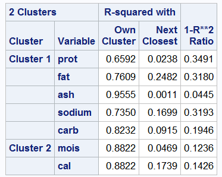

### More Distance Measures
Hamming Distance Measure - distance measure for categorical variables

### Clustering
- What is the goal of clustering?  Create a new product, marketing an existing product
- Principle component analysis is the most frequently used type of variable reduction of continuous variables.
 - Principle component will run with categorical variables, but it is ideal for continuous variables
- Correspondence analysis is better for categegorical variables
 - If you have both continuous and categorical, you can also do things to reduce collinearity.
- You can pick variables out of a cluster to represent the custer
- Canonical Discriminant Analysis (CDA)
 - needs a classification variable.  for example, you may have a loyalty group variable
 - trying to look at the maximum difference between the different classes
- Factor Analysis

- PROC VARCLUS
 - divides a set of variables into non-overlapping clusters or groups so that ou can ultimately select one variable from each of the clusters to represent the group in your final clustering procedure
 - Minimize this: (1 - R^2) / (1 - R^2 next closest cluster) 
  - Equivalent to maximizing R^2 within group / R^2 out of group
SYNTAX:
```
PROC VARCLUS <options>;
   VAR variables;
RUN;
Options - CENTROID, MAXC, MAXEIGEN, OUTTREE, PROPORTION
```

 


R^2 values show you correlation of each variable with its own cluster
