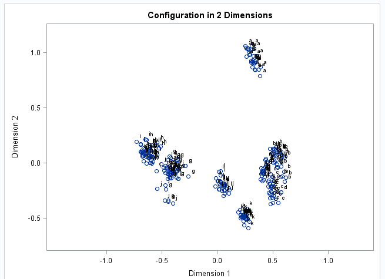

### Highly recommended textbook
Multivariate Data Analysis by Joseph F. Hair Jr, William C. Black, Barry J. Babin, Rolph E. Anderson
http://www.amazon.com/Multivariate-Data-Analysis-7th-Edition/dp/0138132631

### Multi-Dimensional Scaling
Tries to reduce distance between observations in a reduced dimensional space as compared to the distance between observations in full space
You want minimize badness of fit.

Monotonic transformation of the data - preserve the order of the data.

PROC MDS in SAS

Mostly this method is used for graphical representation

### Canonical discriminant Analysis CDA
- Supervised classification method
- Given a classifican variable, find a linear combinaton of interval (or ordinal) variables which maximize the separation
- Procedure gives you an orthoginal components
- Compared to PCA
 - Similar to principal components, but CDA requires a class variable and maximizes between group variation rather than overall variation
- Compared to Discrimant analysis 
 - Discrimant analysis is for prediction
 - CDA could be used for prediction, but it is really intended for maximizing separation
 
### Correspondence Analysis
- Using nominal data
- If you do have interval & categorical data, you should run two separate dimension reduction techniques and then find a way to combine them

### Factor Analysis
- Reduce the number of variables into a smaller number of uncorrelated variables called "Factors"
- *This and PCA are most commonly used*
- Steps
 - compute the factorability of the matrix.
  - Barlett's test of sphericity: are the variables correlated?
   - tests whether the correlation matrix the identity matrix
   - you want a low p-value since this will imply correlation; otherwise you can't do variable reduction
  - Kaiser-Meyer-Olkin measure of sampling adequacy: looks at *common* and *specific* variance.  
   - Higher common variance compared to specific variance is better
   - if KMO < .5, don't do factor analysis
- Extract an initial solution to determine # of factors that need to be extracted for initial solution
- If necessary *rotate* the factors to clarify the factor pattern
- Depending on subsequent applications, copute a factor score for each subject on each factor
- Definition: "Loadings" - between -1 and 1, represent correlations between variables

### Notes from article on PCA vs. FA
- "The aim of factor analysis is to reveal any latent variables that cause the manifest variables to covary" (note: a latent variable is one which is not observed but rather inferred)
- "In common factor analysis, a small number of factors are extracted to account for the intercorrelations among the observed variables--to identify the latent dimensions that explain why the variables are correlated with each other. In principal component analysis, the objective is to account for the maximum portion of the variance present in the original set of variables with a minimum number of composite variables called principal components."
- Many methods for Factor Analysis
 - In general, Maximimum Likelihood best when you have normally distributed data.  When not normally distributed, Principal Axis Factors is a good method
- Choosing which factors to retain
 - Most applications by default keep factors with eigenvalues > 1.  *This often retains too many factors.*
 - Scree test is better.  Graph eigenvalues and look for a natural bend in the curve
 

