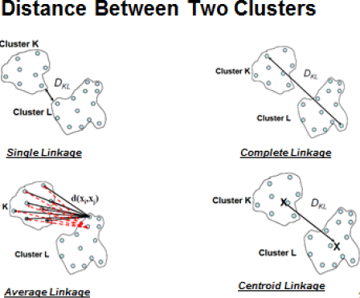

Hierarchical Clustering
- Does not scale well
- Types: Agglomerative/ Divisive
- Popular Methods: Average Linkage Method and Ward's Method
- Ward's Method
 - distance is total sum of squared deviations from the mean of each cluster
- Single Linkage Method 
 - "Nearest Neighbor" agglomerates the clusters with the two nearest observations
 - sensitive to noise and outliers
 - produces long, elongated clusters
- Complete Linkage
 - Observations that are furthest apart.
 - agglomerates clusters with the smallest maximum distance
- Average Linkage
 - Finds average distance from one cluster to the average distance to the next cluster
 - agglomerates the closest clusters

Confusion matrix and cramer's v are included

Binary variables tend to be automatically used for binary variables

Two-step clustering
- Useful for large datasets

