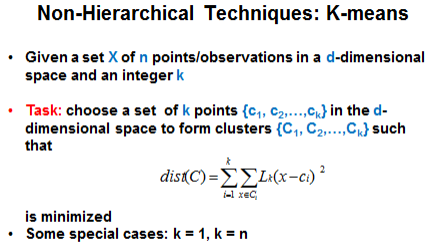

### Clustering
Hierarchical clustering increases exponentially as sample size increases
Because of this, K-means clustering is used most commonly
- Have to specify # of clusters before you run the analysis
- Influenced by:
 - choice of seeds
 - presence of outliers
 - order in which seeds are read
- Goal is to maximize the separation between clusters AND within cluster similarity
- Homogeneity - how cohesive are the clusters
- Steps
1. Choose seeds
2. Add values to clusters
3. Move points to different clusters if doing so reduces the trace

- Replace = Full helps to specify good seeds

R^2 = 1 - T_w / T_B.  
Smaller value of the within cluster varition compared to the without cluster variation, the higher R^2.

Cubic Clustering Criteria - CCC
- > 2 means good cluster
- Negative value indicates outlier
- To decide on number of clusters, look for maximum CCC

Pseudo F - measures separation between clusters
Pseudo t^2 - smaller value is better
