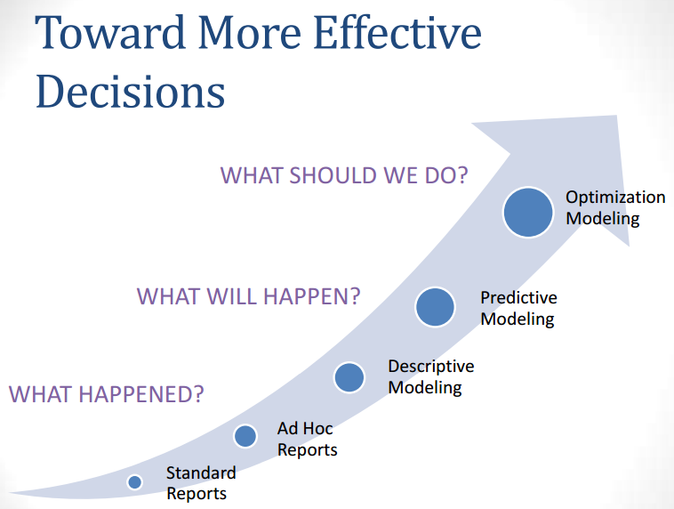
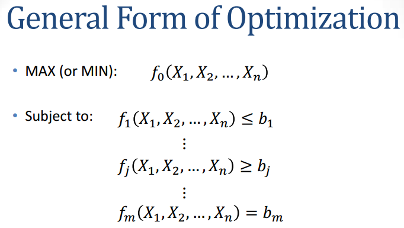

10/29

### Definition of Optimization - best preformance with limited resources

### Linear programming: *MAIN TOOL* Allocation, blending and covering problems
- Data Envelopment Analysis (DEA), a sophisticated linear programming approach to evaluating the efficiency of similar businesses or operating units. 
- Network models: Transhipment, Traveling salesman, etc.
- Integer and mixed integer programing: Usage of binary variables in optimization
### Nonlinear optimization
- Example: best portfolio return at given level of risk
- Optimization & Simulation: Chance constraints,  uncertain objective functions
 - How to come up with quick answer without rerunning monte carlo many times
 
Books:
- Management science: The art of modeling with spreadsheets (Available in the IAA library)
 - Risk Solver Platform
- Applied Operating Research with SAS(Available in the IAA library)
- SAS (OPTMODEL, Data-step, etc)
 - OPTMODEL: http://support.sas.com/documentation/cdl/en/ormpug/63975/HTML/default/viewer.htm#ormpug_optmodel_sect001.htm
- Excel (Risk Solver Platform)

Predictive Modeling is the imput for optimization. 
Identify the meaning of the variables when you set up the model.

### Terminology
- Decision Variables: correspond to decision/choices in the problem under our control which optimal values are to be determined.
- Objective function: measure of performance we are trying to maximize.  Ex: cost, profit, production
- Constraints: restrictions that limit our choice of decision variables
 - Binding - satisfied as equality NOT inequality.  restricts your decisions
 - Non binding - satisfied as inequality]
 - Area where constaints are met is called the *feasible region*

OPTMODEL parses constraints and automatically removes any redundant constraints

Main Types of Optimization Problems
- Linear Programming – objective function and 
constraints are linear. 
- Integer Linear Programming – objective function and 
constraints are linear but decision variables must be 
integers. 
- Mixed Integer Linear Programming – same as ILP 
with only some decision variables restricted to 
integers. 
- Non-linear Programming – objective function and 
constraints continuous but not all linear.

### Steps in LP models
- Understand the problem at hand. 
- Identify the decision variables. 
- State the objective function as a linear combination of the 
decision variables 
- State the constraints as linear combinations of the decision 
variables. 
5. Identify any upper or lower bounds on the decision variables. 

### Simplex Algorithm
1. identify starting position
2. move to adjacent extreme point, if this will improve the value of the objective function
3. repeat step 2, until there is no adjacent extreme point that improves the objective function

### Dual Simplex Algorithm
Same as simplex, but moves along infeasible regions.
