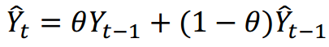
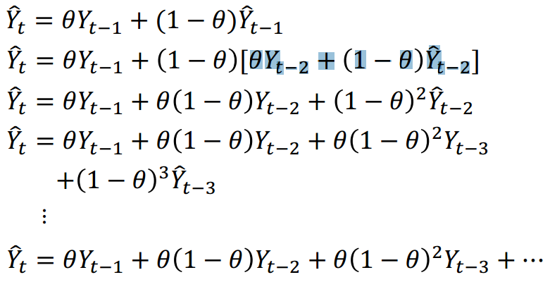
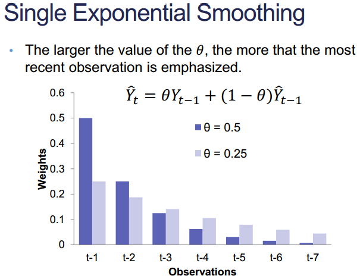
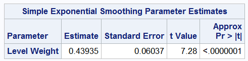
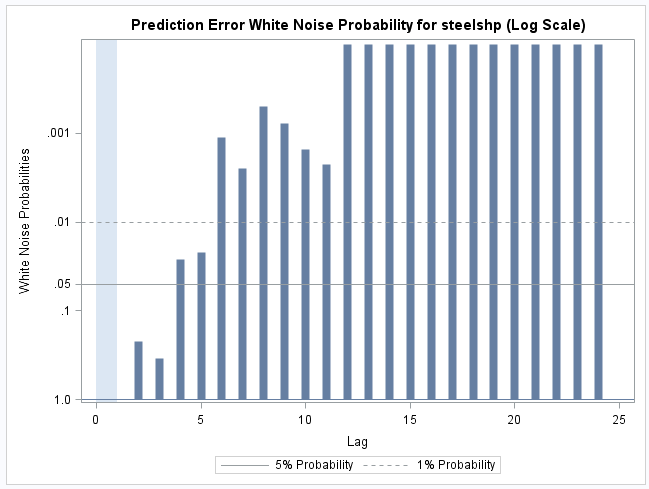
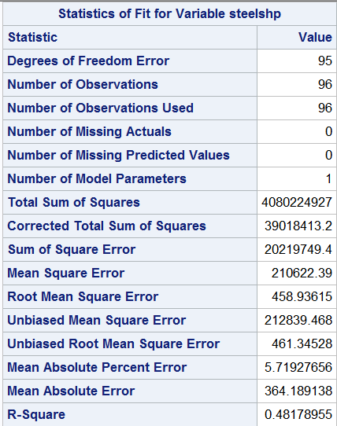
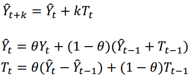
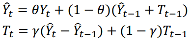
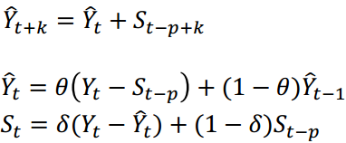
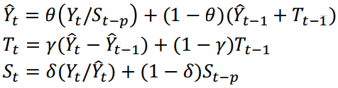

Taught by Dr. Labarr, Dr. Dickey, and Charlie Chase

Assignments: one from Dr. Labarr, one from Dr. Dickey, one from Charlie.  HW1 is posted
Forecast server for final project

### Exponential Smoothing
- Developed in 40s and 50s.  Simple and still perform very well
- built on idea that recent observations have greatest influence
- exponential decay

- lecture has Y hat, but books often use "s" instead.
- weighted average of what happened yesterday and what was predicted for yesterday

We can progressively subsitute and get the above.
Theta controls exponential rate of decay.  Closer to 1 puts more emphasis on recent obs, while closer to zero puts more emphasis on obs further in the past.

### Parameter Estimations
- originally, they just wanted to minimize the next-day forecast errors.  didn't look at statistical significance, just looking for best prediction
- over time, people have studied the distribution.

Exponential smoothing is equivalent to ARIMA(0, 1, 1).  

You can use PROC ARIMA, but PROC ESM is also very nice

Estimate for Theta

Standardized PACF, ACF, IACF (WHY DOES IT GIVE US the standardized????)

Double/Brown Exponential smoothing on both the Y and the Trend.  Assume same coefficient for both.

Linear/Holt exponential smoothing.  A little more complex b/c it involves both coefficients

### Damp Trend Exponential Smoothing
- When you believe it will eventually become stationary

### Seasonal Exponential Smoothing
- Same idea, but you use the season
- Both additive and multiplicative
- 

Additive Seasonal: 

Winters Model:  
Can be additive or multiplicitve.  Includes trend and seasonal

Multiplicitive Season - when season is not staying consistent accross time.  Seasonal effects changing accross time

