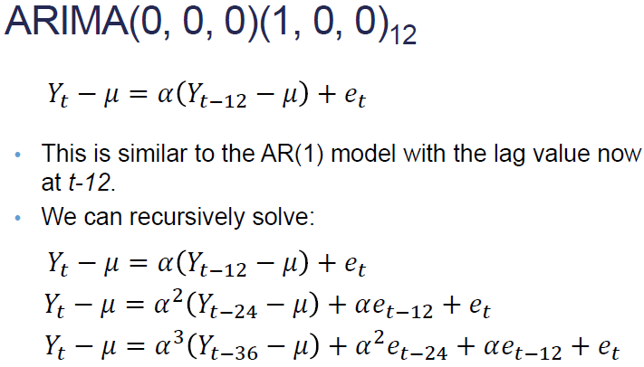

Seasonality
 - S is defined as the seasonal period
 - Three ways to model seasonality
  - Seasonal dummy variables
   - indicate a specific time point
   - can only use 1 less dummy variable than # of seasons
   - Disadvantages: gives equal weight of all the previous months... recent seasons are not weighted more.  But isn't last January usually more related to this January?
  - Trigonometric functions
  - Seasonal ARIMA models

WHAT DOES STOCHASTIC MEAN?

ARIMA
ARIMA(p,d,q)(P,D,Q)s
p, d, and q are the orders of the nonseasonal items

ACF function for seasonal AR has a spike every 12 periods.  Same pattern as with AR(1), but repeats every 12 months.

Dickey-Fuller
- Zero Mean
 - is the mean zero 
- Single Mean
 - Null hypothesis is non-stationarity.  So, we want to see low p-values since we want our data stationary.
- Trend
 - Stochastic trend around a trending mean

If you has seasonality, it will invalidate the Dickey Fuller Test
Dickey Fuller test is for stochastic trend, not for determistic trend
If Dickey Fuller shows *stochastic trend*, then you should *difference*.

First remove the largest season, then smaller.  Ex - first weekly, then daily.

### Backshift Operator aka Shift Operator
- Is a function for creating lags
- B(Y_t)= Y_t-1
- B^2(Y_t) = Y_t-2
- 

Math behind multiplicitive model

You can visually see whether it should be multiplicitive.  The multiplicitive cycles will change over time.  Also, the ACF will have big spike on the season with small spikes on either side.  This is a tell-tale sign of a multiplicitive model.

